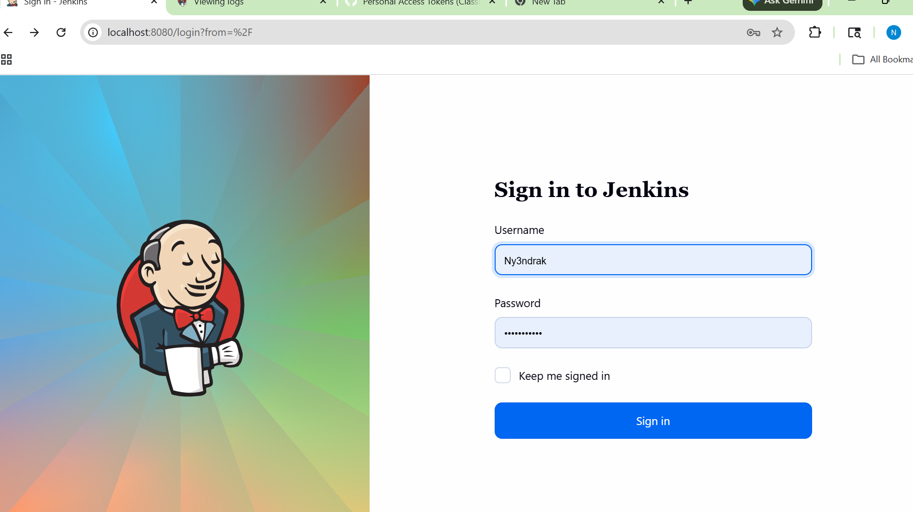
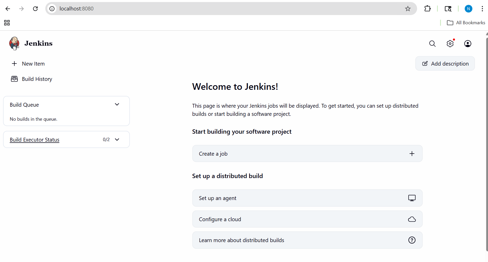
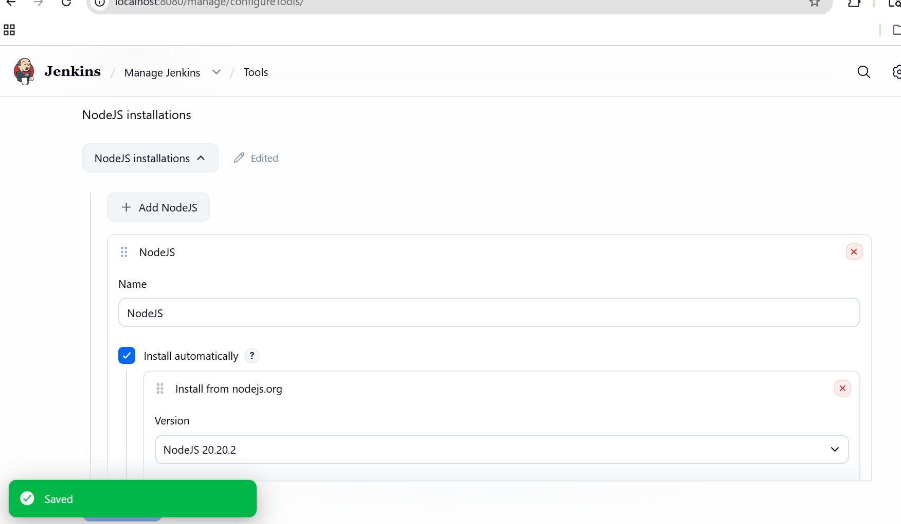
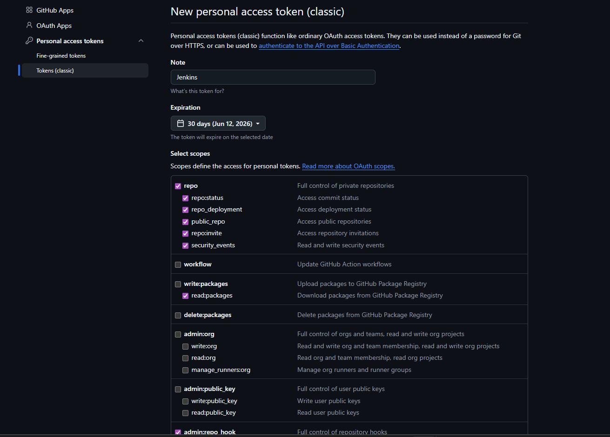
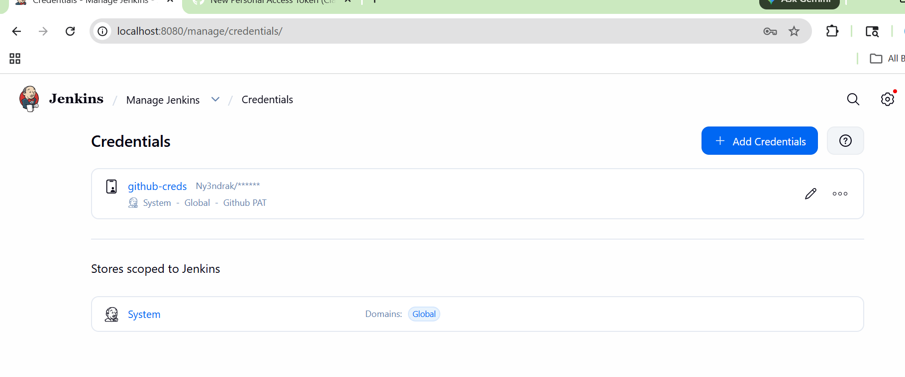
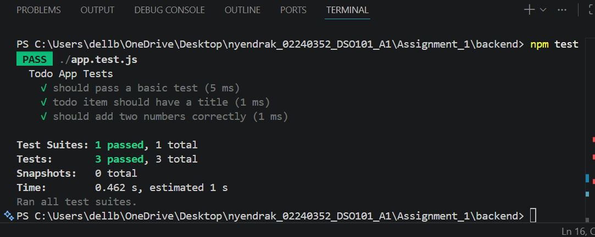
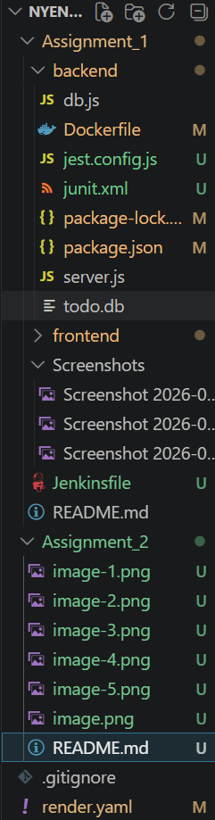

# Assignment II - Continuous Integration and Continuous Deployment (DSO101)
**Student Name:** Nyendrak  
**Student Number:** 02240352  
**Course:** DSO101 - CI/CD  
**Submission Date:** 25th March  

---

## 📋 Table of Contents
1. [Overview](#overview)
2. [Tools & Technologies](#tools--technologies)
3. [Task 1 - Jenkins Setup](#task-1-jenkins-setup)
4. [Task 2 - GitHub Repository Setup](#task-2-github-repository-setup)
5. [Task 3 - Jenkinsfile Pipeline](#task-3-jenkinsfile-pipeline)
6. [Task 4 - Running the Pipeline](#task-4-running-the-pipeline)
7. [Pipeline Configuration](#pipeline-configuration)
8. [Challenges Faced](#challenges-faced)

---

## Overview

In this assignment, a Jenkins pipeline was configured to automate the build, test, and deployment of the To-Do List application built in Assignment 1. The pipeline automates the following stages:

- ✅ Code checkout from GitHub
- ✅ Dependency installation (npm)
- ✅ Build step (React frontend)
- ✅ Unit testing (Jest)
- ✅ Deployment (Docker image pushed to Docker Hub)

---

## Tools & Technologies

| Tool | Purpose |
|------|---------|
| Jenkins | CI/CD automation |
| GitHub | Source code hosting |
| Node.js & npm | JavaScript runtime & package management |
| Jest | Testing framework |
| Docker | Containerization |

---

## Task 1: Jenkins Setup

### 1.1 Installing Jenkins

Jenkins was downloaded from [jenkins.io/download](https://jenkins.io/download) and installed on localhost:8080.

**Steps taken:**
1. Downloaded Jenkins LTS `.msi` installer for Windows
2. Installed Java 21 (Eclipse Temurin) as a prerequisite
3. Ran the Jenkins installer and configured it to run as a Windows service
4. Accessed Jenkins at `http://localhost:8080`
5. Unlocked Jenkins using the initial admin password from:
```
C:\ProgramData\Jenkins\.jenkins\secrets\initialAdminPassword
```

📸 **Screenshot 1: Jenkins unlock screen**
>

📸 **Screenshot 2: Jenkins dashboard after login**
> 

---

### 1.2 Installing Required Plugins

The following plugins were installed via **Manage Jenkins > Plugins > Available**:

| Plugin | Purpose |
|--------|---------|
| NodeJS Plugin | Enables npm commands in pipeline |
| Pipeline | Core pipeline functionality |
| GitHub Integration | Connects Jenkins to GitHub |
| Docker Pipeline | Enables Docker commands in pipeline |
| Git Plugin | Source code checkout |

📸 **Screenshot 3: Installed plugins page**
> _Add screenshot of Manage Jenkins > Plugins > Installed tab showing all plugins listed above_

---

### 1.3 Configuring Node.js in Jenkins

Node.js was configured via **Manage Jenkins > Tools > NodeJS installations**:

- **Name:** `NodeJS`
- **Version:** `NodeJS 20.x LTS`

📸 **Screenshot 4: NodeJS tool configuration**
> 

---

## Task 2: GitHub Repository Setup

### 2.1 Repository Structure

The GitHub repository follows this structure from Assignment 1:

```
nyendrak_02240352_DSO101_A1/
├── frontend/
│   ├── Dockerfile
│   └── .env.production
├── backend/
│   ├── Dockerfile
│   ├── app.test.js
│   └── .env.production
├── Jenkinsfile
├── render.yaml
└── README.md
```

### 2.2 Generating GitHub Personal Access Token (PAT)

A GitHub PAT was generated via **GitHub > Settings > Developer Settings > Personal Access Tokens** with the following permissions:
- ✅ `repo` (full repository access)
- ✅ `admin:repo_hook` (webhook management)

📸 **Screenshot 5: GitHub Personal Access Token creation**

---

### 2.3 Adding GitHub Credentials to Jenkins

GitHub credentials were added via **Manage Jenkins > Credentials > System > Global credentials**:

- **Kind:** Username with password
- **Username:** GitHub username
- **Password:** GitHub PAT token
- **ID:** `github-creds`

📸 **Screenshot 6: Jenkins credentials page**


---

## Task 3: Jenkinsfile Pipeline

### 3.1 Unit Tests

Jest was installed and configured in the backend:

```bash
npm install --save-dev jest jest-junit
```

The following test file (`app.test.js`) was created:

```javascript
describe('Todo App Tests', () => {
  test('should pass a basic test', () => {
    expect(1 + 1).toBe(2);
  });

  test('todo item should have a title', () => {
    const todo = { title: 'Buy groceries', completed: false };
    expect(todo.title).toBeDefined();
    expect(todo.completed).toBe(false);
  });

  test('should add two numbers correctly', () => {
    const add = (a, b) => a + b;
    expect(add(2, 3)).toBe(5);
  });
});
```

📸 **Screenshot 7: npm test running locally**
> 

---

### 3.2 Jenkinsfile

The following `Jenkinsfile` was created in the root of the repository:

```groovy
pipeline {
    agent any
    tools {
        nodejs 'NodeJS'
    }
    stages {
        stage('Checkout') {
            steps {
                git branch: 'main',
                    url: 'https://github.com/yourusername/nyendrak_02240352_DSO101_A1.git',
                    credentialsId: 'github-creds'
            }
        }

        stage('Install Backend Dependencies') {
            steps {
                dir('backend') {
                    sh 'npm install'
                }
            }
        }

        stage('Install Frontend Dependencies') {
            steps {
                dir('frontend') {
                    sh 'npm install'
                }
            }
        }

        stage('Build Frontend') {
            steps {
                dir('frontend') {
                    sh 'npm run build'
                }
            }
        }

        stage('Run Tests') {
            steps {
                dir('backend') {
                    sh 'npm test'
                }
            }
            post {
                always {
                    junit 'backend/junit.xml'
                }
            }
        }

        stage('Deploy') {
            steps {
                script {
                    docker.build('yourdockerhub/be-todo:02240352', './backend')
                    docker.withRegistry('https://registry.hub.docker.com', 'docker-hub-creds') {
                        docker.image('yourdockerhub/be-todo:02240352').push()
                    }
                }
            }
        }
    }
}
```

📸 **Screenshot 8: Jenkinsfile in GitHub repository**


---

## Task 4: Running the Pipeline

### 4.1 Creating the Pipeline in Jenkins

A new pipeline was created via:
1. Jenkins Dashboard → **New Item**
2. Name: `todo-app-pipeline`
3. Type: **Pipeline**
4. Configuration:
   - **Definition:** Pipeline script from SCM
   - **SCM:** Git
   - **Repository URL:** `https://github.com/yourusername/nyendrak_02240352_DSO101_A1.git`
   - **Credentials:** `github-creds`
   - **Branch:** `main`
   - **Script Path:** `Jenkinsfile`
5. Clicked **Save** then **Build Now**

📸 **Screenshot 9: Pipeline configuration page**
> _Add screenshot of the Jenkins pipeline configuration showing the SCM settings, repository URL and credentials filled in_

---

### 4.2 Successful Pipeline Execution

📸 **Screenshot 10: Pipeline stages view (Blue Ocean or Stage View)**
> _Add screenshot of the pipeline showing all stages: Checkout ✅, Install Backend ✅, Install Frontend ✅, Build ✅, Test ✅, Deploy ✅ — all green_

📸 **Screenshot 11: Full console output**
> _Add screenshot of the Jenkins console output showing the full build log with no errors — scroll to show the "Finished: SUCCESS" message at the bottom_

---

### 4.3 Test Results in Jenkins

📸 **Screenshot 12: Test results in Jenkins**
> _Add screenshot of the Test Results page in Jenkins showing all 3 tests passed (click on the build number > Test Results to find this)_

---

### 4.4 Docker Hub Image

📸 **Screenshot 13: Docker Hub repository**
> _Add screenshot of hub.docker.com showing your be-todo repository with the 02240352 tag successfully pushed_

---

## Pipeline Configuration

### How the Pipeline was Configured

1. **Jenkins Installation:** Jenkins LTS was installed on Windows with Java 21. Required plugins (NodeJS, Pipeline, GitHub Integration, Docker Pipeline) were installed via the Plugin Manager.

2. **GitHub Integration:** A Personal Access Token was generated from GitHub with `repo` and `admin:repo_hook` permissions. This token was added to Jenkins as a credential with ID `github-creds`.

3. **Node.js Configuration:** Node.js v20 LTS was configured in Jenkins Tools with the name `NodeJS` so pipeline stages can run `npm` commands.

4. **Jenkinsfile:** A declarative pipeline was created with 6 stages — Checkout, Install Backend, Install Frontend, Build, Test, and Deploy. The pipeline pulls code from GitHub, builds the app, runs Jest unit tests, and pushes a new Docker image to Docker Hub on every run.

5. **Unit Testing:** Jest was configured with the `jest-junit` reporter to generate XML test reports that Jenkins can display in the Test Results section.

6. **Docker Deployment:** Docker Hub credentials were added to Jenkins with ID `docker-hub-creds`. The Deploy stage builds a new Docker image and pushes it to Docker Hub automatically.

---

## Challenges Faced

### 1. Jenkins Plugin Dependency Errors
**Problem:** After installing Jenkins, many plugins failed to load due to unsatisfied dependencies showing errors like `workflow-api` missing.  
**Solution:** Went to Manage Jenkins > Plugins > Updates tab, selected all plugins, and updated them all at once. Then restarted Jenkins.

### 2. Java Version Compatibility
**Problem:** Jenkins installer showed "Failed to find compatible Java version (21 or 25)" error.  
**Solution:** Downloaded and installed Eclipse Temurin Java 21 LTS from adoptium.net. Made sure to enable the "Set JAVA_HOME variable" option during installation.

### 3. Service Logon Credentials Error
**Problem:** Jenkins installer showed "Invalid Logon" error (0x8007052e) when trying to set up Windows service credentials.  
**Solution:** Selected "Run service as LocalSystem" option instead of using a specific user account.

### 4. Port Already in Use
**Problem:** Backend server showed `EADDRINUSE: address already in use :::5000` error.  
**Solution:** Used `netstat -ano | findstr :5000` to find the process ID and killed it with `taskkill /PID [id] /F`.

---

## GitHub Repository

🔗 [https://github.com/Ny3ndrak/nyendrak_02240352_DSO101_A1]

---
