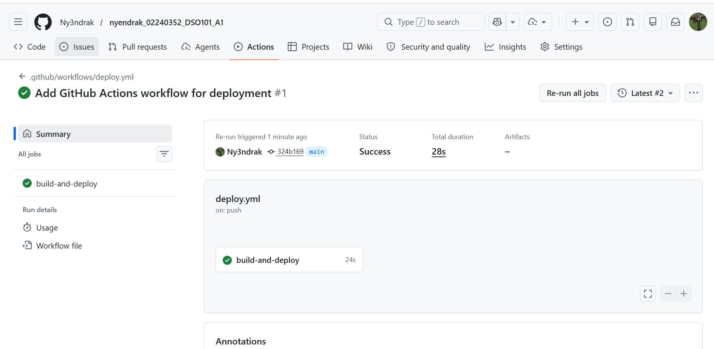
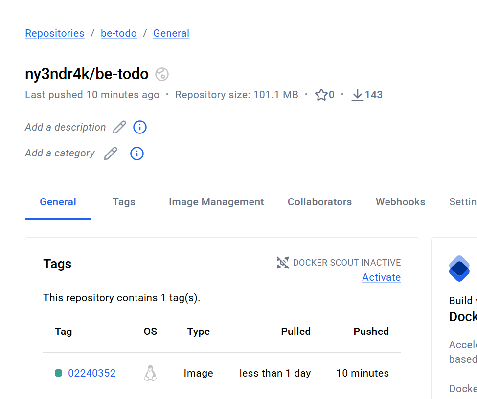
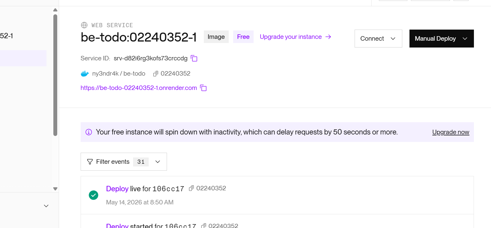
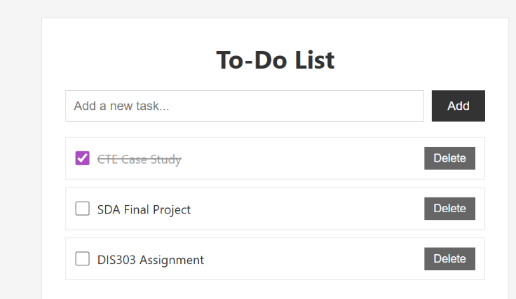

# Assignment 3 — CI/CD Pipeline with GitHub Actions, Docker & Render
**Student:** Nyendrak Yoezer Zangmo  
**Student ID:** 02240352  
**Course:** DSO101 — Continuous Integration and Continuous Deployment  
**Date of Submission:** 29th April  

---

## Overview

This assignment builds on the To-Do List application from Assignment 1. It sets up a full CI/CD pipeline using GitHub Actions to automatically build a Docker image, push it to DockerHub, and deploy it to Render.com whenever changes are pushed to the `main` branch.

---

## Tools & Technologies

| Tool | Purpose |
|---|---|
| GitHub | Hosting source code |
| GitHub Actions | CI/CD automation |
| Docker | Containerization |
| DockerHub | Container registry |
| Render.com | Cloud deployment |
| Node.js & npm | Backend runtime & package management |
| PostgreSQL | Database |
| Jest | Testing framework |

---

## Repository Structure

```
nyendrak_02240352_DSO101_A1/
├── .github/
│   └── workflows/
│       └── deploy.yml          # GitHub Actions workflow
├── Assignment_1/
│   ├── backend/
│   │   ├── Dockerfile          # Docker configuration
│   │   ├── server.js           # Main server file
│   │   ├── db.js               # Database configuration
│   │   ├── package.json
│   │   └── app.test.js         # Jest tests
│   └── frontend/
│       └── ...
└── README.md
```

---

## Steps Taken

### Task 1 — Repository Setup
1. Verified the GitHub repository is set to **public**
2. Confirmed `package.json` contains the required `start` and `test` scripts:
```json
"scripts": {
  "start": "node server.js",
  "test": "jest"
}
```

### Task 2 — Dockerfile
Updated the Dockerfile in `Assignment_1/backend/` to use Node.js 20:
```dockerfile
FROM node:20-alpine
WORKDIR /app
COPY package*.json ./
RUN npm install
COPY . .
RUN npm test
EXPOSE 3000
CMD ["npm", "start"]
```
Tested locally using:
```bash
docker build -t ny3ndr4k/be-todo:02240352 .
docker run -p 3000:3000 ny3ndr4k/be-todo:02240352
```

### Task 3 — GitHub Actions Workflow
Created `.github/workflows/deploy.yml` to automate the pipeline:
- On every push to `main`, it logs into DockerHub, builds the image, pushes it, and triggers a Render redeploy via webhook.

Added the following GitHub Secrets:
- `DOCKERHUB_USERNAME` — DockerHub username
- `DOCKERHUB_TOKEN` — DockerHub personal access token
- `RENDER_DEPLOY_WEBHOOK` — Render deploy hook URL

### Task 4 — Render Deployment
1. Pushed Docker image manually to DockerHub first
2. Created a new Render Web Service using **"Deploy from existing image"**
3. Used image: `docker.io/ny3ndr4k/be-todo:02240352`
4. Added environment variables in Render for PostgreSQL connection:
   - `DB_HOST`, `DB_PORT`, `DB_USER`, `DB_PASSWORD`, `DB_NAME`, `DB_SSL`
5. Copied the Render Deploy Hook URL and added it as a GitHub Secret

---

## GitHub Actions Workflow (deploy.yml)

```yaml
on:
  push:
    branches: ["main"]

jobs:
  build-and-deploy:
    runs-on: ubuntu-latest

    steps:
      - name: Checkout Repository
        uses: actions/checkout@v4

      - name: Login to DockerHub
        uses: docker/login-action@v3
        with:
          username: ${{ secrets.DOCKERHUB_USERNAME }}
          password: ${{ secrets.DOCKERHUB_TOKEN }}

      - name: Build and Push Docker Image
        run: |
          docker build -t ${{ secrets.DOCKERHUB_USERNAME }}/be-todo:02240352 ./Assignment_1/backend
          docker push ${{ secrets.DOCKERHUB_USERNAME }}/be-todo:02240352

      - name: Trigger Render Deployment
        run: |
          curl -X POST ${{ secrets.RENDER_DEPLOY_WEBHOOK }}
```

---

## Screenshots

### 1. GitHub Actions — Successful Workflow


---

### 2. DockerHub — Pushed Image


---

### 3. Render.com — Successful Deployment


---

### 4. Live Application


---

## Render Deployment URL

🔗 **https://be-todo-02240352-1.onrender.com**

---

## Challenges Faced

1. **Docker Hub authentication error** — The Jenkins pipeline was using the wrong username (`ny3ndrak` instead of `ny3ndr4k`). Fixed by updating the credential in Jenkins with the correct username and a Personal Access Token instead of a password.

2. **Docker EOF network error** — Docker couldn't pull the `node:18-alpine` base image due to a network interruption. Fixed by restarting Docker Desktop.

3. **Database connection refused** — The app was defaulting to `localhost:5432` because the environment variables were not yet set in Render. Fixed by adding all `DB_*` environment variables in the Render service settings.

4. **Password authentication failed** — The `DB_PASSWORD` value was incorrect. Fixed by revealing the password from the Render PostgreSQL dashboard and carefully copying it into the environment variable.

5. **Render deploy webhook** — Render does not automatically redeploy when a new Docker image is pushed to DockerHub. Fixed by adding a `curl` call to the Render deploy webhook in the GitHub Actions workflow.

---

## Learning Outcomes

- Learned how to write a GitHub Actions workflow for CI/CD automation
- Understood how Docker images are built, tagged, and pushed to DockerHub
- Gained experience configuring cloud deployments on Render.com
- Learned the importance of environment variables and secrets management — never hardcoding credentials
- Understood how to connect a cloud-hosted app to a cloud-hosted PostgreSQL database
- Learned how to trigger automated redeployments using Render webhooks

---